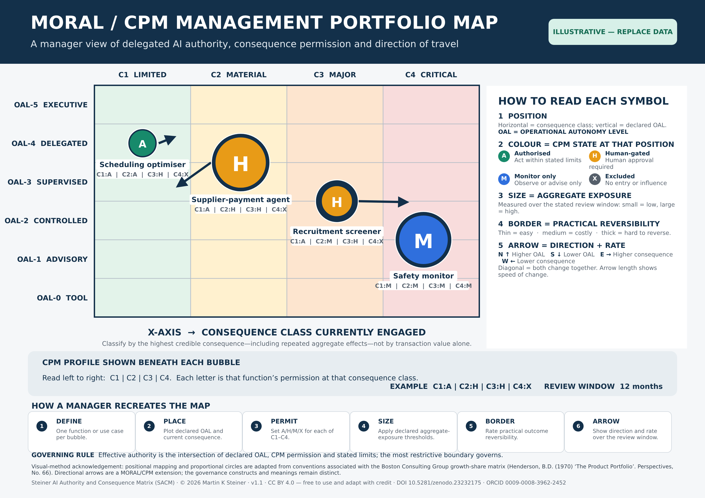

# Steiner AI Authority and Consequence Matrix (SACM)
### The MORAL/CPM Management Portfolio Map — v1.1

SACM is a free, open framework for deciding how much authority an AI system should hold. It asks not just *"how autonomous is the AI?"* but *"which consequences may it cause, and under what control?"*

## The two dimensions
**Operational Autonomy Level (OAL):** OAL-0 Tool · OAL-1 Advisory · OAL-2 Controlled · OAL-3 Supervised · OAL-4 Delegated · OAL-5 Executive

**Consequence class:** C1 Limited · C2 Material · C3 Major · C4 Critical

## Consequence Permission Model (CPM)
For each consequence class, an AI function is given one state:

| State | Meaning |
|---|---|
| **A** | Autonomous |
| **H** | Human approval required |
| **M** | Monitor / advise only |
| **X** | Prohibited |

Example profile: `C1:A | C2:H | C3:H | C4:X` (supplier-payment agent). Plot each AI system's profile on the Portfolio Map to see, govern and review your whole AI estate.

## Files
- `SACM_From_Operational_Autonomy_to_Consequence_Permission_v1.1.docx` — the paper
- `SACM_MORAL_CPM_Portfolio_Map_v1.1.png` — the A4 Portfolio Map

## Licence
[CC BY 4.0](https://creativecommons.org/licenses/by/4.0/) — free to use, adapt and share, including commercially, **with credit to the author**.

## How to cite
Steiner, M. K. (2026). *Steiner AI Authority and Consequence Matrix (SACM): the MORAL/CPM Management Portfolio Map* (v1.1). Zenodo. https://doi.org/10.5281/zenodo.23233809

Author: Martin K. Steiner · ORCID [0009-0008-3962-2452](https://orcid.org/0009-0008-3962-2452) · https://www.martinsteiner-author.co.uk
